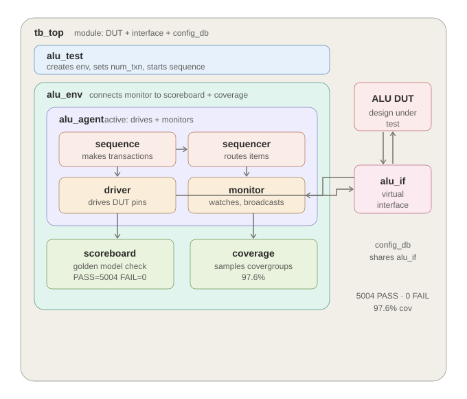
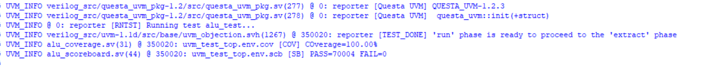
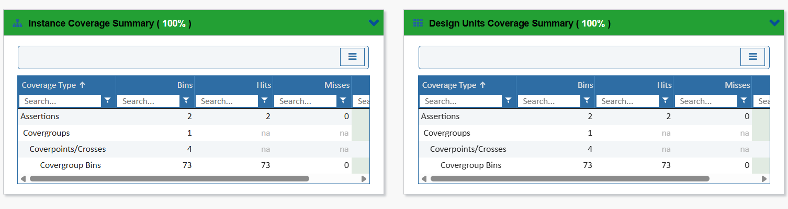

# UVM Verification Environment for a 32-bit ALU

A complete UVM (Universal Verification Methodology) testbench built from scratch to verify a 32-bit RISC-V-style Arithmetic Logic Unit. The environment achieves **PASS = 70004, FAIL = 0** across randomized and directed corner-case stimulus, with **100% functional coverage** and a clean simulation run.

> **Note on code access:** This is a showcase of the verification work and results. The full source code is kept private — see [Code Access](#code-access) below to request it.

---

## Overview

This project verifies a combinational ALU that supports 13 operations (arithmetic, logical, shifts, comparisons, and immediate-based operations) selected by a 4-bit control field. The testbench is a full class-based UVM environment covering the complete stimulus-to-checking flow: sequence generation, driving, monitoring, self-checking against a golden reference model, and functional coverage collection.

The design under test exposes two 32-bit operands (`A`, `B`), a 4-bit operation select (`con`), a 32-bit result (`res`), and a `zero` flag.

---

## Architecture



```
tb_top  (interface + DUT + config_db + run_test)
  |
  +-- alu_test
        |
        +-- alu_env
              |
              +-- alu_agent
              |     +-- alu_sequence  ->  uvm_sequencer  ->  Driver
              |     +-- Monitor
              |
              +-- alu_scoreboard
              +-- alu_coverage
```

Data flow:

```
sequence -> sequencer -> driver -> alu_if -> DUT
                                                |
                                    monitor <---+  (via alu_if)
                                       |
                        +--------------+--------------+
                        v                             v
                   scoreboard                     coverage
```

The `alu_if` virtual interface is the bridge between the class-based testbench and the RTL DUT. The driver drives the DUT pins through the interface, and the monitor observes them through the same interface. The monitor's single analysis port broadcasts each observed transaction to both the scoreboard and the coverage collector simultaneously (one-to-many TLM connection).

---

## Results

| Metric | Value |
|--------|-------|
| Transactions | 70004 (70000 random + 4 directed corners) |
| Pass | 70004 |
| Fail | 0 |
| Functional coverage | 100% |
| Covergroup bins | 73 / 73 hit (0 misses) |
| Assertions | 2 / 2 passing |
| Simulator | QuestaSim 2024.1 (UVM-1.1d) |

The transaction count reflects the constrained-random transactions plus 4 directed corner cases (`0/0`, `max/max`, `0/max`, `max/0`) that exercise operand extremes the random distribution may under-sample.

### Simulation output



### Coverage summary



---

## Components

The environment is built from the following components (source kept private):

| File | Role |
|------|------|
| `alu_transaction.sv` | Sequence item: randomized `A`, `B`, `con` with shift-amount constraints |
| `alu_sequence.sv` | Generates random transactions plus 4 directed corner cases |
| `Driver.sv` | Pulls items from the sequencer and drives the DUT pins |
| `Monitor.sv` | Passively samples the DUT pins and broadcasts reconstructed transactions |
| `alu_agent.sv` | Bundles sequencer, driver, and monitor (active/passive aware) |
| `alu_scoreboard.sv` | Golden-model reference check, pass/fail accounting |
| `alu_coverage.sv` | Covergroups on operation, operand ranges, and cross coverage |
| `alu_env.sv` | Instantiates and connects agent, scoreboard, and coverage |
| `alu_test.sv` | Creates the environment and launches the sequence |
| `alu_if.sv` | Virtual interface bundling all DUT signals |
| `tb_top.sv` | Top module: instantiates DUT + interface, seeds `config_db`, calls `run_test` |
| `ALU.v` | Design under test |

---

## Key Verification Features

- **Self-checking scoreboard** — an independent golden model recomputes the expected result for every operation and compares it against the observed DUT output, so failures are caught automatically without manual inspection.
- **Constrained-random stimulus** — operands are fully randomized; shift operations constrain the shift amount to a sensible range to keep stimulus meaningful.
- **Directed corner cases** — the sequence appends operand extremes to guarantee boundary conditions are tested regardless of random distribution.
- **Functional coverage** — covergroups track every operation code, banded operand ranges, and their cross product; 73 of 73 bins are hit, reaching 100% functional coverage.
- **Config-driven** — the virtual interface and transaction count are passed through `uvm_config_db`, and the count is overridable at runtime via a plusarg.

---

## Environment

- Built and validated on **QuestaSim 2024.1** with the built-in **UVM-1.1d** library.
- Compiled as a single compilation unit (`-mfcu`) so the class and macro definitions resolve across files.
- Transaction count is controllable at runtime via a `+NUM_TXN` plusarg (no recompilation needed).

---

## What This Demonstrates

This environment maps a classic modular SystemVerilog testbench onto the standard UVM structure: transaction to `uvm_sequence_item`, generator to `uvm_sequence` plus `uvm_sequencer`, and mailbox-based hand-offs to TLM analysis ports. It exercises the core UVM concepts a verification engineer relies on daily — the component/object distinction, the build/connect/run phase system, `config_db` for interface and parameter distribution, analysis-port broadcasting, objection-based phase control, and coverage-driven verification — all applied to a real, self-checking, coverage-closed testbench that reaches 100% functional coverage with zero failures.

---

## Code Access

The full source code for this project is kept private. If you would like to review it (for hiring, collaboration, or learning purposes), it is available on request:

- **Request access:** [Google Drive folder]https://drive.google.com/drive/folders/1xSDvdhXdhbNyYVedXpKqbN_wPffL7lj4?usp=sharing
- **Or contact me:** sahukumarpratyush2004@gamil.com

Access is granted on request — please include a brief note on why you'd like to see the code.
